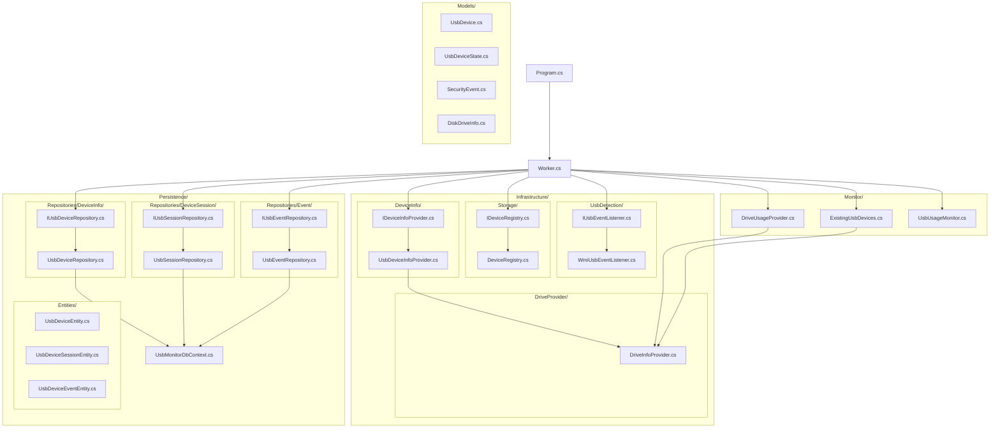
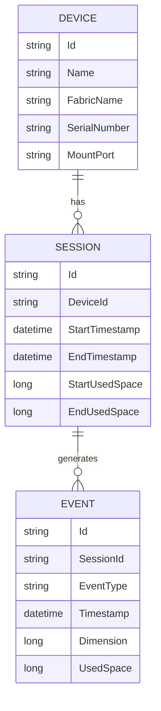

# UsbMonitoringService


Servizio .NET Worker per monitorare dispositivi USB, registrare eventi di connessione/disconnessione e salvare informazioni persistenti.

## table of contents
- [Introduction](#introduction)
- [Demo](#demo)
- [Architecture](#architecture)
- [Features](#features)
- [Coverage Area](#coverage-area)
- [Tech Stack](#tech-stack)
- [Dependencies](#dependencies)
- [Installation](#installation)
- [Usage](#usage)
- [Estensioni Future](#estensioni-future)
- [Contributing](#contributing)
- [License](#license)

## Introduction

`UsbMonitoringService` è un servizio `Worker` pensato per tracciare in modo continuo l'attività delle periferiche esterne collegate al sistema, con particolare focus su audit e persistenza dei dati.
Il servizio è progettato per essere eseguito in background ed è stato pensato per scenari in un contesto aziendale o di ufficio. Per prevenire possibili fughe di dati.
Il flusso principale del servizio include:

- **Monitoraggio delle periferiche esterne**: controllo costante dei dispositivi USB presenti e di quelli collegati durante l'esecuzione del servizio.
- **Detection degli eventi di connessione e disconnessione**: rilevamento in tempo reale dell'inserimento e della rimozione delle periferiche.
- **Recupero delle informazioni della periferica inserita**: acquisizione di metadati utili (ad esempio identificativo dispositivo, descrizione, percorso, timestamp di rilevamento).
- **Monitoraggio della dimensione della periferica esterna**: raccolta delle informazioni di capacità totale, spazio libero e spazio utilizzato per ciascun dispositivo monitorato.
- **Rilevamento di eventi di scrittura/rimozione file**: tracciamento delle operazioni di creazione, modifica ed eliminazione file effettuate sulla periferica esterna.
- **Persistenza per sessione di traccia**: salvataggio strutturato su database di eventi, dispositivi e sessioni per garantire storicizzazione, consultazione e analisi successive.

Questa architettura permette di avere una visione cronologica completa delle attività avvenute sulle unità esterne, rendendo il servizio adatto a scenari di monitoraggio operativo e controllo. 

## Demo

Da aggiungere screenshot o output del servizio in esecuzione, mostrando eventi USB rilevati e salvati nel database.

## Architecture

Architettura logica del progetto (classi e package principali):



## Schema E/R delle entità principali:



Flusso ad alto livello:

1. `Worker` avvia i componenti di detection e bootstrap dei device esistenti.
2. I listener in `Infrastructure` intercettano eventi runtime (insert/remove e attività file).
3. I repository in `Persistence` salvano eventi, dispositivi e sessioni sul database.
4. Il registro dispositivi mantiene lo stato corrente delle periferiche durante la sessione.

## Features

- Rilevamento eventi USB in background
- tracciamento di operazioni di connessione/disconnessione e scrittura/rimozione file
- generazione di alerts sugli eventi rilevati mediante log di sistema.
- Persistenza di informazioni sulla periferica inserita, sessioni di traccia e eventi su database

## Coverage Area

Casi d'uso testati dal servizio:

- Inserimento e rimozione di uno o più dispositivi con mountpoint diversi
- Rilevamento di un dispositivo già connesso all'avvio del servizio
- Rilevamento di un dispositivo connesso al PC dopo shutdown e reboot del sistema
- Rilevamento di un dispositivo connesso allo shutdown e rimosso prima del reboot
- Aggiunta e rimozione di uno o più file sulle periferiche
- Edge case per aggiunta/rimozione file non andate a buon fine (chiavetta rimossa prima del completamento dell'operazione)

## Tech Stack

- .NET 8 Worker Service
- Entity Framework Core
- WMI per rilevamento USB (Windows)

## Dependencies

Le principali librerie/pacchetti utilizzati per l'implementazione del servizio sono:

- `Microsoft.Extensions.Hosting` per il modello `Worker Service` e la gestione del ciclo di vita del processo
- `Microsoft.Extensions.DependencyInjection` per la dependency injection
- `Microsoft.Extensions.Logging` per logging e alert tramite log di sistema
- `Microsoft.EntityFrameworkCore` per accesso ai dati e persistenza
- `Microsoft.EntityFrameworkCore.Sqlite` per l'integrazione con il database
- `System.Management` per il rilevamento eventi USB tramite WMI su Windows
- `System.IO.FileSystem.Watcher` (namespace `System.IO`) per il monitoraggio di creazione/modifica/rimozione file sulle periferiche

## Installation

1. **Clona il repository**

```bash
git clone https://github.com/PiladeJr/UsbMonitoringService.git
cd UsbMonitoringService
dotnet restore
```

2. **Scegli la modalità di esecuzione**

### Opzione A - Esecuzione diretta (test rapido)

Se si desidera eseguire il servizio in modalità console per testarlo localmente, è possibile avviare direttamente il progetto. non sono richieste ulteriori operazioni di installazione.

### Opzione B - Installazione come servizio di sistema (background)

Pubblica il progetto e registra il servizio tramite `sc.exe create`.

```bash
dotnet publish -c Release -o .\publish
sc.exe create UsbMonitoringService binPath= "(<inserire-il-percorso-completo-dove-hai-pubblicato-il-servizio>\UsbMonitoringService.exe)" start= auto
```

## Usage

### Modalità programma (test locale)

```bash
dotnet run --project UsbMonitoringService.csproj
```

### Modalità servizio Windows (background)

```bash
sc.exe start UsbMonitoringService
```

## Estensioni Future

Possibili evoluzioni del servizio:

- **Copia file da chiavetta a PC**: funzionalità orientata a scenari EDR per intercettare operazioni di esfiltrazione locale. Nota: una implementazione completa è sensibilmente più complessa dell'attuale servizio e può richiedere integrazioni esterne oltre lo scope corrente (ad esempio provider eventi kernel tramite ETW).
- **Whitelisting e politiche di sicurezza**: gestione di una whitelist dispositivi per ridurre alert su periferiche autorizzate (mantenendo comunque la persistenza su database), alert dedicati su dispositivi non whitelisted e possibile blocco operativo su questi ultimi.
- **Dati euristici sulle operazioni**: introduzione di un motore di scoring per assegnare un indice di gravità alle sequenze di eventi (es. trasferimenti di file molto grandi, copia file + disconnessione rapida, burst di attività sospetta).
- **Interfaccia di visualizzazione**: dashboard/UI per consultare eventi tracciati, sessioni e dispositivi connessi.
- **Tamper detection**: politiche di riavvio e meccanismi di segnalazione in caso di shutdown imprevisto o interruzione forzata del servizio.

## Contributing

Pull requests welcome.

## License

Questo progetto è distribuito sotto licenza [MIT](LICENSE).
